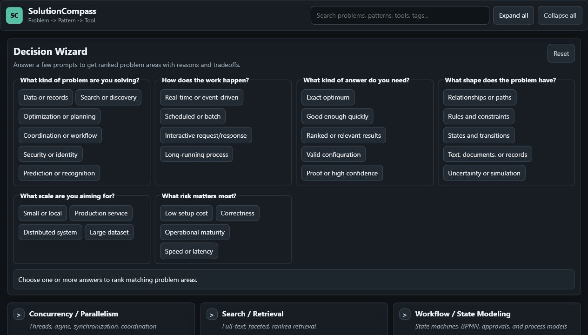
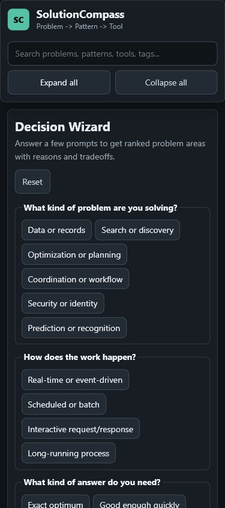

# SolutionCompass

SolutionCompass is a lightweight, offline-capable decision support app for navigating from **Problem -> Pattern -> Tool/Algorithm**. It combines a searchable reference catalog with a guided wizard that recommends likely solution areas and explains why they matched.

## Status

MVP+ is functional and deployable on GitHub Pages.

- Static React/Vite PWA with install support and offline caching.
- Decision Wizard with answer-based scoring and recommendation explanations.
- Searchable catalog of problems, patterns, tools, algorithms, examples, snippets, and references.
- Reference links show source/authority badges such as official docs, standards, academic papers, vendor docs, reference, or community.
- Shareable deep links for focused problem areas, such as `#/problem/vector-search-embeddings`.
- Clickable tag chips for quick taxonomy filtering.
- Scope lens for Architecture, Stack, Runtime, Library, Language, Algorithm, and Hardware views.
- Impact lens for Core, Common, Specialized, and Archival material; core work-impacting classes sort first by default.
- Catalog Signals panel summarizes scope, impact, snippet coverage, and implementation guidance counts.
- Zoom Mode maps from business goal and platform type down through workload, architecture, stack, patterns, implementation, and deliverables.
- Evaluation Mode maps engineering roles to useful signals, weak signals, practical exercises, and related problem areas.
- Core/common problem areas include a `firstMove` recommendation to steer the first practical action.
- Tree and Compare views for browsing cards or scanning solutions in a dense table.
- Normalized dataset with `39` problem areas, `83` patterns, and `261` solutions.
- Every solution has a short blurb and reference URL.
- Every problem area has decision metadata: best fit, avoid conditions, tradeoffs, complexity, maturity, scale, and setup cost.
- Dataset validation is available with `npm run validate:data`.
- Wizard scenario validation is available with `npm run validate:wizard`.
- AI/model references have an audit trail in `docs/ai-source-audit.md`.

## Screenshots





## Features

| Area | Details |
|---|---|
| Decision Wizard | 6 guided prompts use weighted rules, boosts, suppressions, and scenario checks to recommend 3-5 matching problem areas. |
| Result explanations | Recommendations show matched answers, fit metadata, and tradeoffs. |
| Decision map | Problem -> Pattern -> Solution hierarchy with tags, examples, references, and snippets. |
| Compare view | Dense solution table with problem, pattern, tool, language, fit, complexity, and reference columns. |
| Deep links | Problem cards can be focused and shared with `#/problem/<slug>` URLs. |
| Search | Full-text filtering across titles, tags, examples, decision metadata, patterns, solutions, tools, languages, blurbs, snippets, and URLs. |
| Source badges | Reference URLs are classified with authority badges so users can distinguish official docs, standards, academic papers, vendor docs, and background references. |
| Tag filters | Problem tags are clickable chips for quick exact-tag filtering. |
| Scope lens | Segmented filtering from architecture down to hardware and algorithms. |
| Impact lens | Prioritizes common production work while keeping trick/interview patterns mostly archival. |
| Catalog signals | Summary metrics show useful/core vs specialized/archival coverage and snippet/reuse guidance counts. |
| Zoom Mode | Business-to-implementation fly-through for SaaS/CRM, retail, social, video/media, analytics, AI/RAG, ML platform, and scientific/engineering scenarios. |
| Evaluation Mode | Role-fit assessment guidance for application, backend, platform, data, AI/ML, staff-level, and scientific applications engineering. |
| PWA | Installable, offline-ready static app via `vite-plugin-pwa`. |
| Data validation | Local script checks required fields, URLs, metadata, duplicate problem names, and placeholder tools. |
| Deploy | GitHub Pages compatible build path for `JENkt4k/solution-compass`. |

## Data Model

Dataset location: `public/complete-tree-data.json`

```ts
export interface Solution {
  name: string;
  tool: string;
  language: string;
  blurb?: string;
  timeComplexity?: string;
  spaceComplexity?: string;
  reuseLevel?: 'hand-roll' | 'library-preferred' | 'design-replaced' | 'archival';
  implementationNote?: string;
  code?: string;
  url?: string;
}

export interface Pattern {
  name: string;
  solutions: Solution[];
}

export interface ProblemNode {
  problem: string;
  scopeLevel?: 'architecture' | 'stack' | 'runtime' | 'library' | 'language' | 'algorithm' | 'hardware';
  impactLevel?: 'core' | 'common' | 'specialized' | 'archival';
  tags: string[];
  subcategory?: string;
  description?: string;
  examples?: string[];
  firstMove?: string;
  bestFor?: string[];
  avoidWhen?: string[];
  tradeoffs?: string[];
  stillBestWhen?: string[];
  replacedBy?: string[];
  failureModes?: string[];
  complexity?: string;
  maturity?: string;
  scale?: string;
  setupCost?: string;
  patterns: Pattern[];
}
```

## Development

```bash
npm install
npm run dev
```

Open the local Vite URL printed by the command.

## Validation

```bash
npm run validate:data
npm run validate:wizard
npm run validate
```

The validator fails on:

- Missing problem, pattern, or solution fields.
- Missing solution `blurb`, `url`, or `language`.
- Missing time/space complexity for snippet-bearing solutions.
- Missing problem decision metadata.
- Missing `firstMove` on core/common problem areas.
- Missing or invalid problem `scopeLevel`.
- Missing or invalid problem `impactLevel`.
- Invalid solution `reuseLevel`.
- Invalid URLs.
- Generic `tool: "Example"` placeholders.
- Duplicate problem names.
- Empty pattern or solution lists.

The wizard validator checks representative recommendation scenarios for AI/RAG, vector memory, AI deployment, ETL/ELT, graph search, optimization, security, prediction/recognition, architecture, hardware/runtime, and scientific/engineering methods.

## Build

```bash
npm run build
npm run serve
```

The Vite base path is `/` in dev and `/solution-compass/` in production for GitHub Pages.

## Deploying to GitHub Pages

```bash
npm run build
npm run deploy
```

Or use the existing GitHub Pages workflow in `.github/workflows/pages.yml`.

## Current Gaps

- Wizard scoring is transparent and useful, but still weighted-rule scoring rather than a full rules engine.
- Zoom Mode is a first-pass static set of reference tracks; it does not yet generate custom diagrams or migration plans.
- Evaluation Mode is guidance-oriented; it does not yet produce scored interview rubrics or exported evaluation packets.
- Rare scientific/engineering methods are represented selectively; broader GIS, CAE, CFD, and multiphysics coverage is still intentionally incomplete.
- AI/RAG, search, vector retrieval, and memory guidance is deeper than before but still needs periodic source review and domain-specific eval examples.
- Source/authority badges are inferred from URL domains; edge cases may need explicit per-solution metadata later.
- Snippet coverage is selective: graph search, A*, IDA*, beam search, knapsack, LCS, edit distance, MST, Huffman coding, activity selection, CP-SAT, SQL CRUD, Redis cache, and network flow examples are covered, but many tools intentionally link to references instead of embedding code.
- Tag filtering is exact-match only; it does not yet support AND/OR combinations.
- No editable dataset UI yet.

## Shipping Requirements

The project is already shippable. Stop expanding the scope for this phase when these are true:

- `npm run validate:data` passes.
- `npm run validate:wizard` passes.
- `npm run build` passes.
- Live GitHub Pages smoke test passes on desktop and mobile.
- Install icon, install prompt, offline-ready message, and update refresh prompt look correct after reinstall.
- Wizard returns sensible recommendations for at least these scenarios: AI/RAG, vector memory, optimization, search, ETL/ELT, deployment, and security.
- README counts match the dataset.

After that, ship and collect real use feedback before adding more topic families.

## Roadmap

Short term:

- Clickable tag chips with AND/OR filter modes.
- Reference architecture diagrams for Zoom Mode platform tracks.
- More scenario fixtures for wizard edge cases.
- Scheduled source-audit pass for rapidly changing AI/model claims and references.

Medium term:

- Stronger wizard scoring with explicit constraints and incompatibility rules.
- Local editable dataset UI with JSON import/export.
- Contribution workflow that runs `npm run validate:data`.
- Graph/tree visualization mode.
- Accessibility pass for keyboard navigation and focus management.

Long term:

- Pluggable datasets from URL or Gist.
- Multi-user editorial workflow.
- Rules engine for recommendations with weights, constraints, and explainable tradeoffs.

## License

MIT
